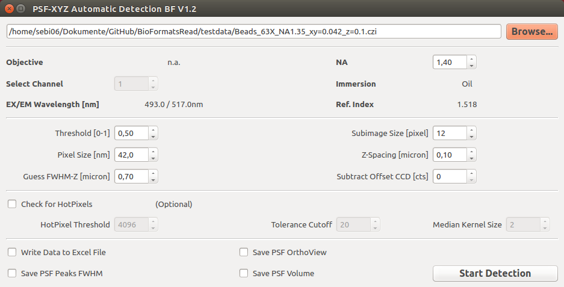
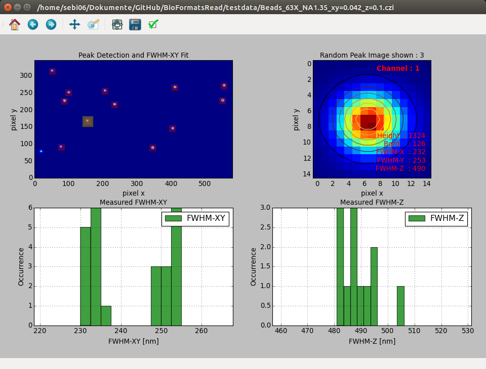
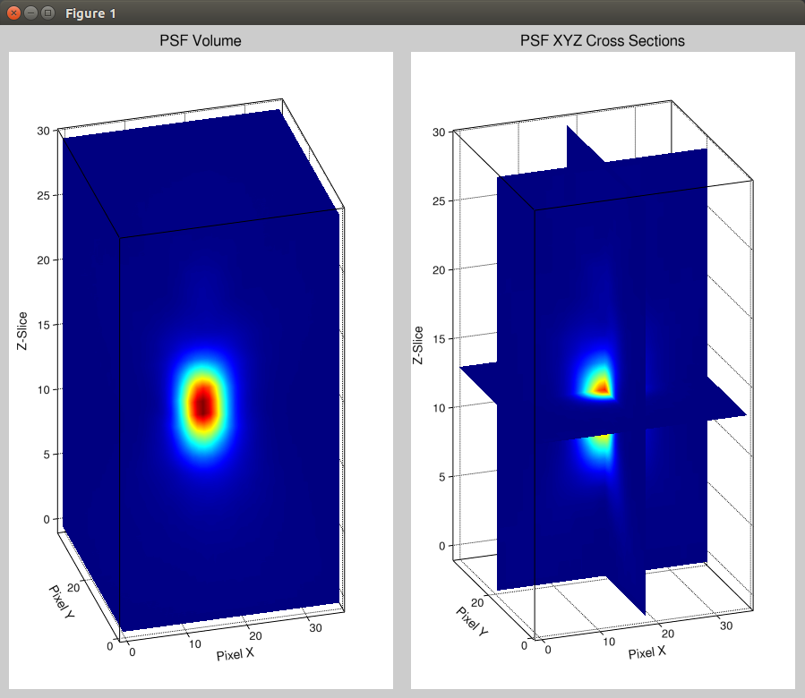
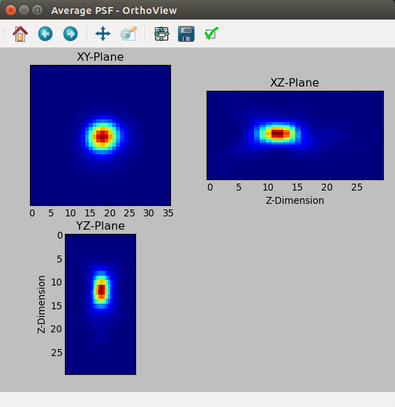

===============================
PSF-XYZ Bead Fit
===============================

This program can be used to detect beads an measures the FWHM-XYZ of the PSF.
The crucial steps are:

* Read the z-stack via BioFormats using python-bioformats.
* Define detection parameters for the selected channel.
* Find the brightest voxel and extract the corresponding XY-plane from Z-Stack.
* Detect all peaks within the extracted XY-plane using scikit-image toolbox.
* Extract the Z-profile at every detected peak position.
* Determine the brightest XY-plane for every peak separately.
* Cutout stack at every detected peak position.
* Do 2D-Gauss fit for every peak to determine FWHM-XY.
* Do 1D-Gauss fit for every Z-Profile to determine FWHM-Z.
* Displays PSF OrthoView and PSF volume for the average PSF = sum of all detected PSFs.
* Displays overview image with all detected peaks and 2D fit from randomly selected peak.
* Optional - Write results to excel sheet (currently only XLS).
* Optional - Save output graphics as PNGs.

:Author: Sebastian Rhode

:Version: 2019.02.08

Requirements
------------
* `Python 3.6 <http://www.python.org>`_
* `Numpy <http://www.numpy.org>`_
* `xlwt <https://pypi.python.org/pypi/xlwt>`_
* `SciPy <https://pypi.python.org/pypi/scipy>`_
* `VisVis <https://pypi.python.org/pypi/visvis>`_
* `Scikit-Image <https://pypi.python.org/pypi/scikit-image>`_
* `czifile <https://pypi.org/project/czifile/>`_

Notes
-----
The package is still under development and was mainly tested with CZI files. Fell free to improve it and give feedback.
It uses BioFormats to read the image data into numpy arrays and uses the package bfimage to read the actual image data.

References
----------
(1)  CZI - Carl Zeiss Image format for microscopes - http://www.zeiss.com/czi
(2)  The OME-TIFF format - http://www.openmicroscopy.org/site/support/file-formats/ome-tiff
(3)  The Python-BioFormats package - http://downloads.openmicroscopy.org/bio-formats/

Screenshots
-----------

Main GUI:

FHWM Report:

PSF Volume & Cross Sections:

PSF OrthoView:

